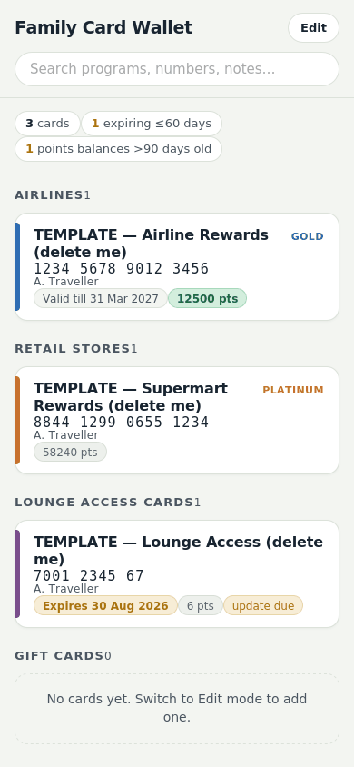
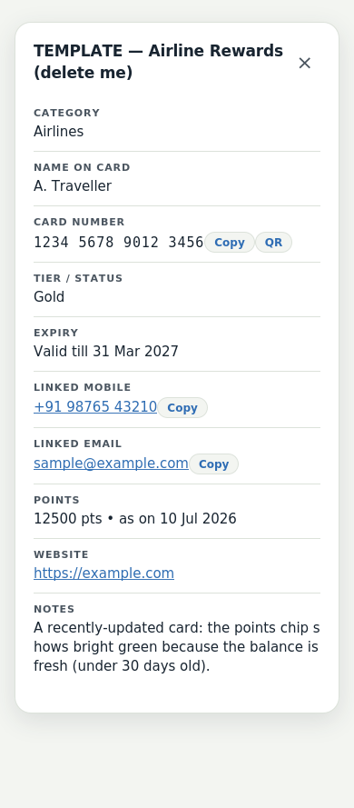
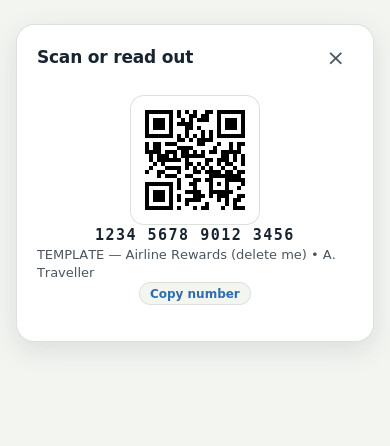
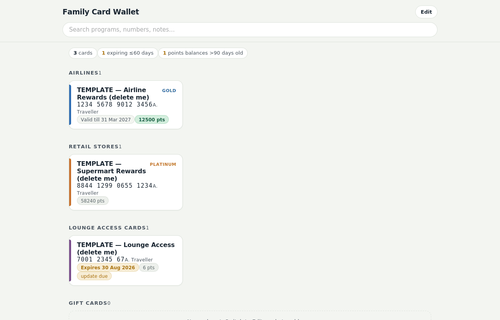

# Card Wallet — a single-file, offline loyalty card organiser

See it here: https://yshashank.github.io/offline-card-wallet/

**One HTML file. No app, no account, no cloud, no tracking. Your data never leaves your device.**

Card Wallet keeps all your loyalty cards, membership numbers, and points balances in a single self-contained HTML file (~57 KB) that opens in any browser — phone, tablet, or laptop — and works fully offline. Your data is stored *inside the file itself*, so your copy of the file **is** your database, your backup, and your app, all at once.

## Screenshots

  
  
  

## Features

- **Card-style interface** — programs rendered as wallet cards, grouped by category (Airlines, Retail, Lounge Access, Gift Cards by default; add your own).
- **Per card**: program name, name on card, card number, tier/status, expiry date, linked mobile and email, points balance with "as on" date, website, and notes.
- **QR code display** — tap any card number to show a large scannable QR with the number in giant type beneath it (for counters where staff key it in).
- **Tap-to-copy** on numbers, mobile, and email; tap-to-dial and tap-to-email links.
- **Expiry intelligence** — cards flag amber within 60 days of expiry, red when expired; a summary strip counts both.
- **Points freshness tiers** — balances show bright green if updated within 30 days, muted at 31–90 days, and amber "update due" beyond 90 days, nudging a monthly refresh habit.
- **Search** across programs, numbers, names, and notes.
- **Read-only by default** — an explicit Edit mode prevents accidental changes during everyday browsing.
- **Import / Export** — move your data into a new app version in seconds: Import reads either an exported JSON backup **or a previous wallet HTML file directly**, so upgrading never means re-typing your cards.
- **CSV export** — one tap produces an Excel-compatible snapshot. Card numbers are deliberately wrapped as `="…"` in the CSV — that formula wrapper is what stops Excel mangling long numbers into scientific notation, so leave it as-is.
- **Built-in guide** — a collapsed "How to update this wallet" section at the bottom covers the update routine and even how to add new fields.

## Quick start

1. **Download** `card-wallet.html` (right-click → Save link as, or use the download button on the release page).
2. **Open it** in any browser — double-click on desktop, or open from your Files app / Drive on mobile.
3. Tap **Edit**, delete the three TEMPLATE cards (they exist to demonstrate the freshness and expiry indicators), and add your own.
4. Press **Save file** — a fresh copy downloads with your data inside. **Replace your old copy with it.** This step is the actual save.
5. Store the file wherever you like: local disk, Google Drive, OneDrive, a NAS. Opening it from a cloud drive gives you access on every device.

## ⚠️ Caveats — read before relying on it

These are the honest limitations of the single-file design. They're the price of total privacy and zero infrastructure.

1. **Edits are not saved automatically.** Changes live only in the browser tab until you press **Save file** and replace your old copy with the downloaded one. Close the tab without saving and edits are gone (the app warns you, but browsers can't always guarantee the warning fires). Make "edit → save → replace" one habit.
2. **The downloaded file lands in your Downloads folder**, not on top of your master copy. You must move/replace it yourself. On iPhone, Safari saves to the Files app under Downloads.
3. **There is no sync and no merge.** If you edit the file on two devices in parallel, the last replaced copy wins and the other edits are lost. Designate one "editing device" or edit only from the master location.
4. **Anyone who gets the file gets everything in it.** It is plain HTML — readable in any text editor. Store loyalty and membership numbers only. **Never store payment card numbers, PINs, passwords, CVVs, OTP secrets, or banking credentials.** Those belong in a proper password manager.
5. **Share carefully.** Send it only via private channels (family Drive share with named accounts). Never post your personal copy publicly or attach it to emails casually.
6. **The QR encodes the raw number only.** Some store scanners read only 1D barcodes, and some loyalty apps use proprietary QR payloads — in those cases show staff the large number, or use the brand's own app/wallet pass for scanning.
7. **Backups are your job.** Cloud-drive version history (Google Drive: right-click → Manage versions) is your undo button. A periodic CSV export is a cheap second parachute.
8. **Modern browsers only.** Built and tested for current Chrome, Edge, Safari, and Firefox (2023+). Very old browsers or exotic webviews may not render it correctly.
9. **Don't put your data in a public fork.** If you fork this repository and edit the JSON block on GitHub, your card numbers become publicly readable. The app shows a warning banner when opened from a web address for exactly this reason — download the file and keep your copy private.
10. **No warranty.** This is free software provided as-is (MIT License). Verify your own data; the authors accept no liability for lost points, expired cards, or missed renewals.

## Suggested routine

A ~10-minute monthly pass keeps it trustworthy: open the file, act on whatever the summary strip flags (expired / expiring / "update due" balances), refresh points using the **Today** button, Save file, replace the master copy, optionally export a CSV. The built-in guide (bottom of the page) walks through this.

## Customising

- **Rename the wallet** (Edit mode → Rename wallet) — the saved filename automatically follows the new name.
- **Add or rename categories** freely; each gets its own accent colour.
- **Add new fields** — the built-in guide documents the five small edits needed, or open the file with any AI coding assistant and ask. Existing data carries over untouched.

## Upgrading without losing data

When a new version of Card Wallet is released: download it, open it, tap **Edit → Import data**, and select your old wallet HTML file (the app extracts your data straight out of it — an exported JSON backup works too). Confirm, press **Save file**, and replace your master copy. Your data carries over untouched.

## Privacy statement

This file makes **zero network requests**. No analytics, no fonts, no CDNs, no telemetry, nothing. You can verify this yourself: open browser DevTools → Network tab and watch — it stays empty. Everything, including the QR code generator, is embedded in the file.

## Credits & license

- Card Wallet is released under the **MIT License** — free to use, copy, modify, and redistribute.
- QR code generation by [qrcode-generator](https://github.com/kazuhikoarase/qrcode-generator), © 2009 Kazuhiko Arase, MIT License. "QR Code" is a registered trademark of DENSO WAVE INCORPORATED.
